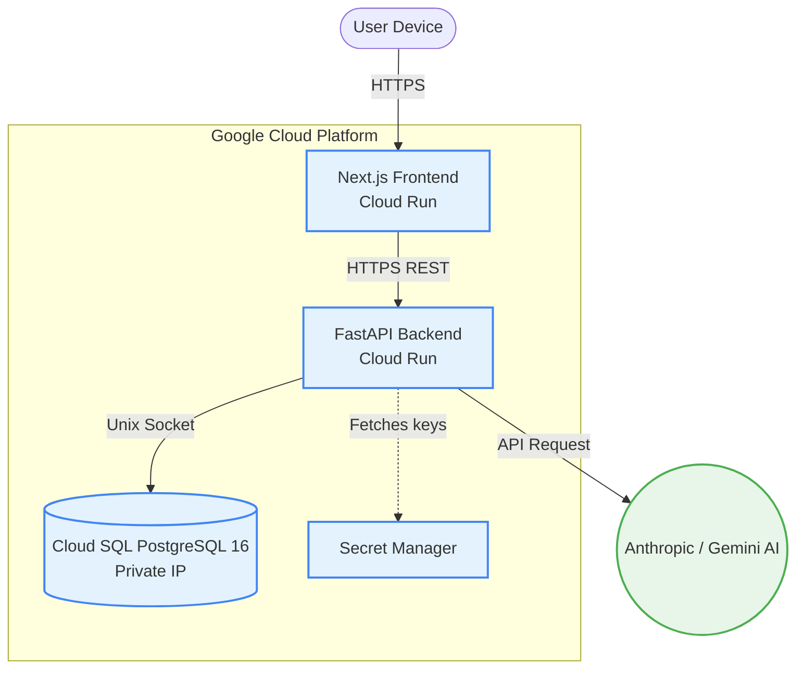
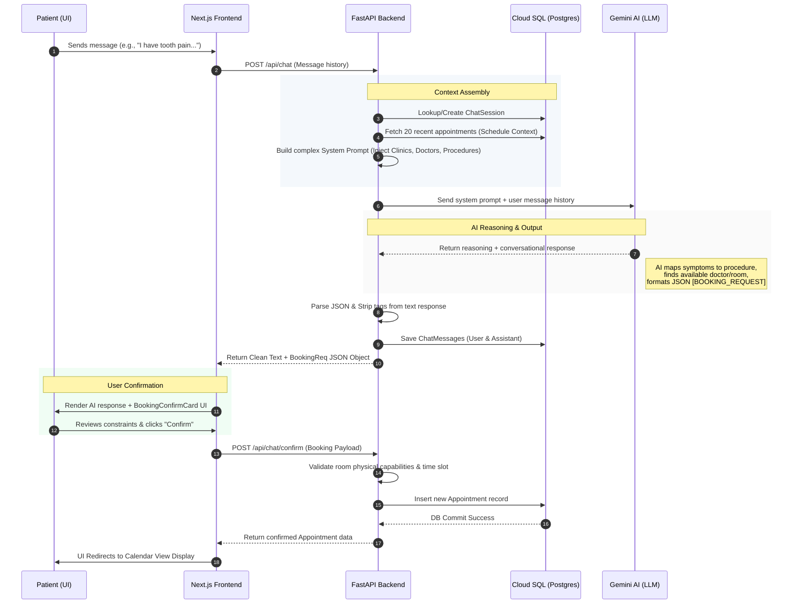

<div align="center">

  <h1 align="center">Appointment Booking System</h1>
  <p align="center">
    A production-grade dental clinic management platform featuring an AI-driven booking assistant, real-time doctor availability, seamless scheduling, and enterprise architecture natively deployed on Google Cloud.
  </p>
  <p align="center">
    
    
    
    
  </p>
</div>

---

## 🏗 System Architecture

MedDent is built on modern, scalable cloud-native principles, employing a decoupled microservices architecture. Both the frontend and backend are containerized and deployed seamlessly to **Google Cloud Run**, establishing private connections to a highly available **Cloud SQL PostgreSQL** database instance.



### 🛠 Core Stack
| Layer | Technology |
|-------|-----------|
| **Frontend** | `Next.js 14`, `React`, `TypeScript`, `Tailwind CSS` |
| **Backend** | `FastAPI`, `Python 3.12`, `SQLAlchemy (Async)`, `asyncpg` |
| **Database** | `Cloud SQL PostgreSQL 16` |
| **Artificial Intelligence** | `Anthropic Claude 3 / Gemini SDK` |
| **Infrastructure** | `Google Cloud Run`, `Secret Manager`, `Artifact Registry` |

---

## 🤖 AI Appointment Booking Flow

The core of MedDent is its autonomous AI booking engine. This sequence diagram illustrates the lifecycle of a patient conversation from the initial symptom description to a committed appointment in the PostgreSQL database.



---

## 📂 Project Structure

A clean monolith repository separating frontend interfaces from backend logic. 

```text
dental-booking/
├── frontend/                     # Next.js 14 Application
│   ├── src/
│   │   ├── app/                  # App Router & Layouts
│   │   ├── components/           # UI Components (Calendar, Chat, Admin)
│   │   └── lib/                  # API Clients & Utilities
│   ├── tailwind.config.js        # Design System Tokens
│   └── Dockerfile                # Multi-stage Cloud Run builder
│
├── backend/                      # Python FastAPI Service
│   ├── app/
│   │   ├── main.py               # Fast API Application Context
│   │   ├── database.py           # SQL Alchemy Connection Pools
│   │   ├── models.py             # ORM Declarations
│   │   ├── routers/              # HTTP Route Handlers
│   │   └── seed.py               # Automated Data Seeding
│   ├── Dockerfile                # Prod-optimized Python Container
│   └── requirements.txt          # PIP Dependencies
│
├── infrastructure/               # DevOps Scripts
│   ├── deploy.sh                 # Zero-downtime GCP provisioner
│   └── update.sh                 # Container redeployment utility
│
└── docker-compose.yml            # Local development orchestration
```

---

## 🚀 Quick Start — Local Development

We provide two primary workflows for bootstrapping the application locally.

### Option A: The Full Stack (Docker Compose)
This utilizes standard Docker orchestration to boot up a local Postgres instance, the backend, and the frontend server.

```bash
# 1. Clone the repository
git clone https://github.com/arsalannkhann/AppointmentBooking.git
cd AppointmentBooking

# 2. Configure Local Secrets
echo "GOOGLE_API_KEY=AIzaSy..." > .env

# 3. Ignite the stack
docker-compose up --build
```
- **Frontend App**: `http://localhost:3000`
- **Backend API**: `http://localhost:8000`
- **API Documentation**: `http://localhost:8000/docs`

### Option B: Bare-Metal Execution (Hot Reloading)

*Running the Backend:*
```bash
cd backend
python3 -m venv venv && source venv/bin/activate
pip install -r requirements.txt

# Use a local SQLite instance for instantaneous debugging
export DB_DRIVER=sqlite+aiosqlite
export GOOGLE_API_KEY=AIzaSy...

uvicorn app.main:app --reload --port 8000
```

*Running the Frontend:*
```bash
cd frontend
npm install
echo "NEXT_PUBLIC_API_URL=http://localhost:8000" > .env.local
npm run dev
```

---

## ☁️ Google Cloud Deployment (Production)

The production environment is provisioned identically utilizing immutable `infrastructure` bash scripts.

### 1. Prerequisites 
Ensure your CLI is installed and configured against a Google Cloud Project billing account.
```bash
gcloud auth login
gcloud auth application-default login
gcloud config set project [YOUR_PROJECT_ID]
```

### 2. Zero-touch Provisioning 
Execute the `deploy.sh` script to orchestrate the entire GCP backend architecture, generate secure DB credentials, wire up VPC sockets, and push live HTTP Load Balancers to Cloud Run.
```bash
export GCP_PROJECT=meddent-prod
export GOOGLE_API_KEY=AIzaSy...

chmod +x infrastructure/deploy.sh
./infrastructure/deploy.sh
```

### 3. CI/CD Redeployment
For subsequent hotfixes (e.g., patching the backend python code) use the lightweight updater:
```bash
./infrastructure/update.sh backend
./infrastructure/update.sh frontend
./infrastructure/update.sh all
```

---

## 🗄️ Database Management 

### Cloud SQL Connection Modes

MedDent's connection engine automatically detects the runtime environment to optimize latency securely.

| Mode | When to use | Configuration Trigger |
|------|------------|--------|
| **Unix Socket** | GCP Cloud Run | `USE_UNIX_SOCKET=true` & `CLOUD_SQL_CONNECTION_NAME` |
| **TCP Proxy**   | Debugging / Local Dev | `DB_HOST=127.0.0.1` via Cloud SQL Auth Proxy |
| **SQLite**      | Testing / CI | `DB_DRIVER=sqlite+aiosqlite` |

### Connect to Production DB from Localhost
For secure debugging against the live PostgreSQL database from a developer machine:

```bash
# 1. Run the local Cloud SQL Auth Proxy
./cloud-sql-proxy salesos-473014:us-central1:dentalbridge

# 2. Connect securely using the App's Secret Manager password:
PGPASSWORD=$(gcloud secrets versions access latest --secret=meddent-db-password) \
  psql -h 127.0.0.1 -U postgres -d postgres
```
*(If you have manually overridden the password for the `postgres` user via the Google Cloud Web Console, run the psql line without injecting the PGPASSWORD variable and enter your custom password manually instead!)*

---

## 🔐 Environment Variables Catalog

| Variable | Scope | Description |
|----------|----------|-------------|
| `GOOGLE_API_KEY` | **Backend** | Gemini/Anthropic API credentials injected securely via Secret Manager |
| `DB_PASSWORD` | **Backend** | Provisioned autonomously and stored inside Secret Manager |
| `DB_DRIVER` | **Backend** | Protocol (`postgresql+asyncpg` or `sqlite+aiosqlite`) |
| `DB_NAME` | **Backend** | Target Database schema (Defaults to `postgres`) |
| `DB_USER` | **Backend** | Database administrator role (Defaults to `postgres`) |
| `CLOUD_SQL_CONNECTION_NAME` | **Backend** | Sockets routing format `project:region:instance` |
| `ALLOWED_ORIGINS` | **Backend** | HTTP Origin Whitelist to protect the API via strict CORS protocols |
| `NEXT_PUBLIC_API_URL` | **Frontend** | Backend Cloud Run API URL baked directly into the Next.js bundle parameters |

---

## 📊 Live Endpoints Reference

| Method | Route | Description |
|--------|------|-------------|
| `GET` | `/health` | Kubernetes-friendly status monitor |
| `GET` | `/api/data/*` | Resolves real-time configurations for Clinics, Doctors, & Procedures |
| `GET` | `/api/slots?procedure_id=...` | AI optimization engine identifying ideal scheduling gaps |
| `GET` | `/api/appointments/stats` | Aggregated metrics reporting for the Admin dashboard |
| `POST`| `/api/appointments` | Bootstraps a manual booking creation |
| `POST`| `/api/chat` | Persists AI interactions and evaluates scheduling intent |

**For extensive payload documentation, visit the live `/docs` OpenAPI UI bundled inside the backend service.**
